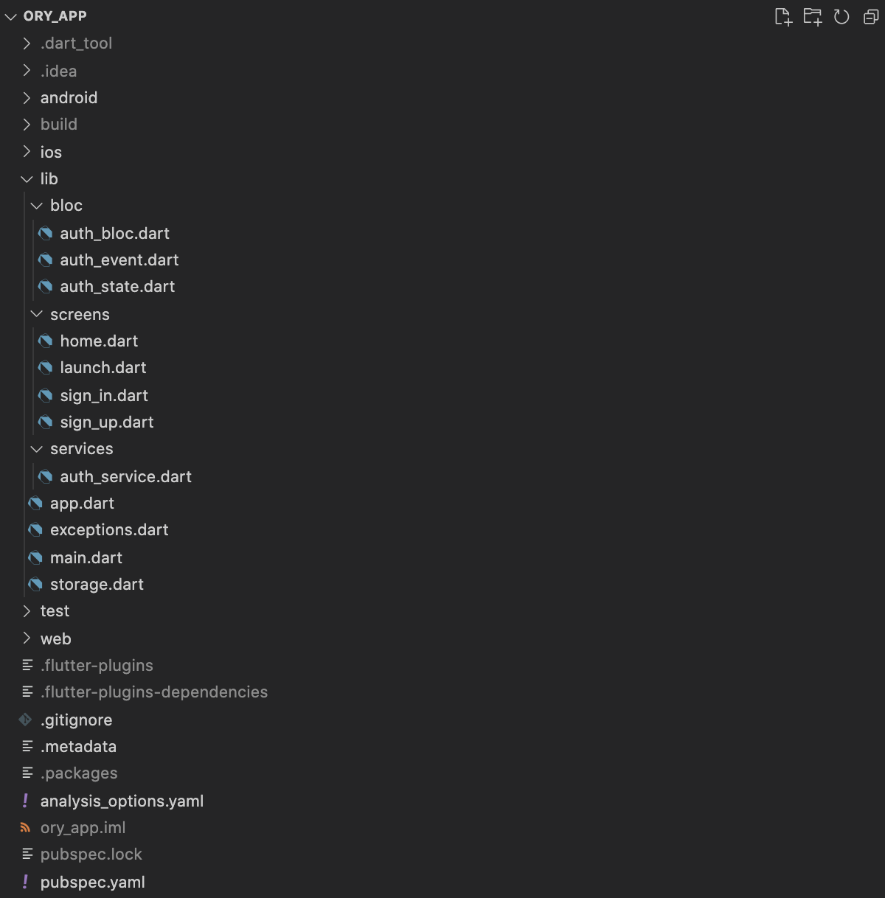
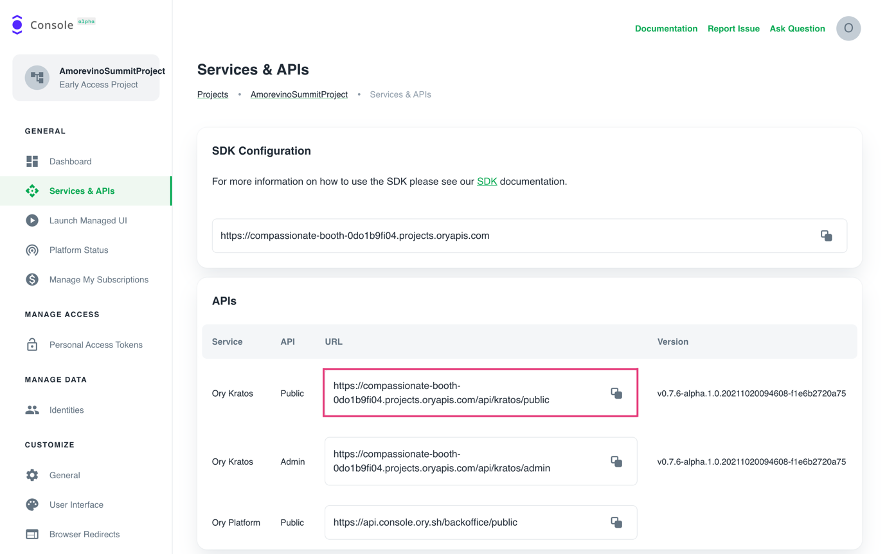

https://www.youtube.com/watch?v=VKLXbrZS7tU

In this tutorial, we will use one of the most popular frameworks for developing
cross-platform applications - Flutter. For authentication, we will use Ory
Kratos as well as the backend app mentioned in the
[first part of this blog post](/cloud-ecommerce-backend/). What is also an
important part is an Ory Cloud project, which will provide us with Ory Kratos
Public API.

There are a lot of solutions for state management in Flutter. I went for the
BLoC design pattern, as I enjoy working with it, and it was also recommended by
Google developers. If you are not familiar with this approach, please check its
dart package [bloc](https://pub.dev/packages/bloc) as well as
[bloc library documentation](https://bloclibrary.dev/).

You can also clone the project with the code samples from
[GitHub](https://github.com/amorevino/ory-showcase-apps).

## The Project

This app is a showcase for authentication using Ory Kratos where users can
create an account and log in.

First, [create a flutter project](https://flutter.dev/docs/get-started/codelab).
We will use material UI for design, `bloc`, and `flutter_bloc` for the state
management, `http` to send API requests, `equatable` to differentiate between
objects of the same class, `flutter_secure_storage` to store a session token,
and `flutter_dotenv` to use our environment variables. Add all these packages to
`pubscpec.yaml` file and get them. Here is a general code structure:



The next sections will explain how to

- Set up environment variables for Ory Kratos and our backend.
- Implement login functions.
- Implement complete login flow and get current user information.
- Run the app on an emulator.

## Set up environment variables for Ory Kratos and our backend

Ory provides its users with a simple and user-friendly console where they can
manage their projects. It also supports other functionalities like customizing
identity schema, managing identities, and browser redirects. Assuming you have
already completed part 1 and created an Ory Cloud project, you'll find all APIs
under the Services & APIs section. Copy Ory Kratos Public API URL:



Then create a .env file in a root directory of the project and add two
variables:

- KRATOS_API="your Ory Kratos Public API URL"
- BACKEND="your backend URL" (from the first post)

It is also important to remember to add this `.env` file to the assets in
`pubspec.yaml` file, otherwise it won’t be found during compilation. With all
installed packages, your dependencies and flutter specific section in
`pubspec.yaml` will look like this:

```yaml
dependencies:
  flutter:
    sdk: flutter
  flutter_bloc: ^7.3.1
  bloc: ^7.2.1
  equatable: ^2.0.3
  http: ^0.13.4
  flutter_secure_storage: ^4.2.1
  flutter_dotenv: ^5.0.2

  # The following adds the Cupertino Icons font to your application.
  # Use with the CupertinoIcons class for iOS style icons.
  cupertino_icons: ^1.0.2

dev_dependencies:
  flutter_test:
    sdk: flutter

  # The "flutter_lints" package below contains a set of recommended lints to
  # encourage good coding practices. The lint set provided by the package is
  # activated in the `analysis_options.yaml` file located at the root of your
  # package. See that file for information about deactivating specific lint
  # rules and activating additional ones.
  flutter_lints: ^1.0.0

# For information on the generic Dart part of this file, see the
# following page: https://dart.dev/tools/pub/pubspec

# The following section is specific to Flutter.
flutter:
  # The following line ensures that the Material Icons font is
  # included with your application, so that you can use the icons in
  # the material Icons class.
  uses-material-design: true

  # To add assets to your application, add an assets section, like this:
  assets:
    - .env
```

To load the `.env` file with dotenv package, add the following code line to the
`main()` function of the app:

```dart
await dotenv.load(fileName: ".env");
```

As you can see, it is quite easy to set up. Now let's move to the implementation
part.

## Implement login functions

To perform a login, we need to dispatch the `InitLogitFLow()` event and the
`AuthBloc` will handle it. This is the implementation of that button:

```dart
 child: ElevatedButton(
   onPressed: () => authBloc.add(SignIn(
       authState.flowId,
       authState.email, authState.password)),
   child: const Text("Sign in"),
 ),
```

There are several steps necessary to complete a login. First of all, we need to
initiate login flow to enable login using Ory Kratos. This ensures that
pre-login hooks run and more. This is done when our app launches or the user
chooses the sign-in option from the SignUp screen. Here is the code for that:

```dart
  Future<String> initiateLoginFlow() async {
    var response = await http
        .get(Uri.parse("$kratosURL/self-service/login/api?refresh=true"));
    if (response.statusCode == 200) {
      final data = jsonDecode(response.body);
      return data["id"]; //return login flow id
    } else if (response.statusCode == 400 || response.statusCode == 500) {
      final data = jsonDecode(response.body);
      final error = data["error"];
      throw UnknownException(error["message"]);
    } else {
      throw Exception();
    }
  }
```

In the code above, we:

- Initiate login flow
- retrieve login flow ID
- retrieve an error message if there is any and throw it.

After we successfully initiated the login flow, we can continue with the actual
login. For that, we need a retrieved login flow ID. Here is a function that
performs the login:

```dart
  Future<String> signIn(String flowId, String email, String password) async {
    var response = await http.post(
        Uri.parse("$kratosURL/self-service/login?flow=$flowId"),
        headers: <String, String>{"Content-Type": "application/json"},
        body: jsonEncode(<String, String>{
          "method": "password",
          "password": password,
          "password_identifier": email
        }));

    if (response.statusCode == 200) {
      final data = jsonDecode(response.body);
      final String sessionToken = data["session_token"];
      return sessionToken;
    } else if (response.statusCode == 400) {
      final data = jsonDecode(response.body);
      final errors = checkForErrors(data);
      throw InvalidCredentialsException(errors);
    } else if (response.statusCode == 500) {
      final data = jsonDecode(response.body);
      final error = data["error"];
      throw UnknownException(error["message"]);
    } else if (response.statusCode == 422) {
      final data = jsonDecode(response.body);
      final error = data["message"];
      throw UnknownException(error);
    } else {
      throw Exception();
    }
  }
```

In the code above, we:

1. perform login using retrieved flow ID and provided by using email and
   password
2. After the user is successfully logged in, his session token is retrieved from
   Ory Kratos and returned
3. If there are form validation errors, they are examined and an
   InvalidCredentialsException is thrown with those errors as its property
4. If there are any other errors, we extract its message from the response and
   throw a corresponding error

Now we have all the functions needed to implement a complete login flow, so
let's jump to the next section.

Implement complete login flow and get current user information

After the user has logged in, we want to display his user-specific information
like session token, an ID that Ory Kratos assigned them, and an email address
that was used for the registration. Here is a code that retrieves all that
information:

```dart
  Future<Map<String, dynamic>> getCurrentSession(String token) async {
    final response = await http.get(
      Uri.parse("$backendURL/whoami"),
      headers: <String, String>{
        "Accept": "application/json",
        "Session_token": token
      },
    );

    if (response.statusCode == 200) {
      final userData = jsonDecode(response.body);
      return Map<String, dynamic>.from(userData["oryUser"]);
    } else if (response.statusCode == 401) {
      throw UnauthorizedException();
    } else if(response.statusCode == 403 || response.statusCode == 500) {
      final data = jsonDecode(response.body);
      final error = data["error"];
      throw UnknownException(error["message"]);
      }else {
      throw Exception();
    }
  }

```

In the code above, we:

- request user information from our backend specifying his session token.
- return oryUser from the JSON response, if it was successful.
- throw an error if the backend response contains it.

The very last step is to wrap up all those functions excluding initiating login
flow into a stream, which will provide us with all necessary data. Here is a
stream that implements the whole login flow and retrieves user information:

```dart

  Stream<AuthState> _signIn(SignIn event) async* {
    try {
      yield AuthLoading();
      final sessionToken =
          await authService.signIn(event.flowId, event.email, event.password);
      await secureStorage.persistToken(sessionToken);
      yield* getCurrentSession(sessionToken);
    } on InvalidCredentialsException catch (e) {
      yield AuthLoginInitialized(
          flowId: event.flowId,
          email: event.email,
          emailError: e.errors["traits.email"] ?? "",
          password: event.password,
          passwordError: e.errors["password"] ?? "",
          generalError: e.errors["general"] ?? "");
    } on UnknownException catch (e) {
      yield AuthLoginInitialized(
          flowId: event.flowId,
          email: event.email,
          password: event.password,
          message: e.message);
    } on UnauthorizedException catch (_) {
      await secureStorage.deleteToken();
      yield const AuthUnauthenticated("Your session expired. Please sign in.");
    } catch (_) {
      yield AuthLoginInitialized(
          flowId: event.flowId,
          email: event.email,
          password: event.password,
          message: "An error occured. Please try again later.");
    }
  }

```

The code above does the following:

- log in user and retrieve a session token.

When the user is successfully logged in, his returned session token must be
stored on the device. This is necessary for performing user-specific requests on
the backend and Ory Kratos, e.g retrieving current session information or
logging out. Here is where Secure Storage comes to help. get current session
information. If there is any error, it is handled depending on its type.

The registration part is implemented in the same way.

That's it! Now you have a simple app that provides a user with a register/login
functionality using Flutter and Ory Kratos.

## Running the app on an emulator

There are a few prerequisites to fulfill to run the app on an Android emulator.
Please keep in mind that this app is intended only for Android devices. I
recorded a short setup video for you in case you haven't set up your environment
yet. Please complete the following steps before watching the tutorial:

- clone fluffer repository
- fork ory showcase app repository
- install android studio

https://www.youtube.com/watch?v=VKLXbrZS7tU

## Conclusion

As you have already noticed, Ory Kratos is a great SSO solution that is easy to
integrate and work with. It also provides developers with security and
flexibility which is one of the reasons why I decided to create this simple app.
I hope this blog post gave you a basic understanding of how to build a simple
mobile app using Flutter and Ory Kratos and you found this article interesting
and helpful. All source code is available on
[GitHub](https://github.com/amorevino/ory-showcase-apps/).
