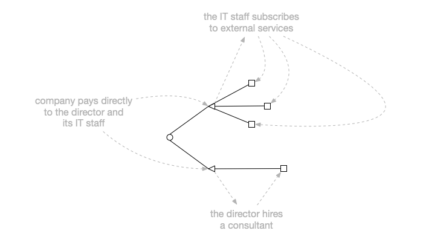

Permissions management is an interesting topic. Modern applications are often
complex beasts. It doesn’t take much time to hit the point where certain
functionality must be allowed only to the selected users or access to a resource
should be granted only under certain conditions.

Building a flexible permissions management system is not easy. They tend to be
tightly coupled with the business logic and executed every time a decision
whether to grant or deny access is required. There are as many requirements as
software systems out there. A permissions management systems must also perform.
If decisions are to be made often, the latency to make a decision must be
minimal.

Ory Keto is one of the Ory platform components and a few days ago it has seen a
major upgrade. Versions 0.6.0-alpha.1 is a complete reimplementation of Keto and
is marketed as the first open source implementation of
[_Zanzibar: Google’s Consistent, Global Authorization System_](https://research.google/pubs/pub48190/).

From the Zanzibar abstract:

> Determining whether online users are authorized to access digital objects is
> central to preserving privacy. This paper presents the design, implementation,
> and deployment of Zanzibar, a global system for storing and evaluating access
> control lists. Zanzibar provides a uniform data model and configuration
> language for expressing a wide range of access control policies from hundreds
> of client services at Google, including Calendar, Cloud, Drive, Maps, Photos,
> and YouTube. Its authorization decisions respect causal ordering of user
> actions and thus provide external consistency amid changes to access control
> lists and object contents. Zanzibar scales to trillions of access control
> lists and millions of authorization requests per second to support services
> used by billions of people. It has maintained 95th-percentile latency of less
> than 10 milliseconds and availability of greater than 99.999% over 3 years of
> production use.

I have been using previous Keto versions for some R&D work. The new version has
sparked my interest because the `firebuild` system I am working on is going to
be in need of a permissions system at some point in time.

To better understand the new Keto, I wanted a simple, easy to follow scenario so
a judgement can be formed quickly.

In one short sentence: **it was very easy and it’s impressive!!**

## The scenario

The scenario I was evaluating:

- a company employs a director and IT staff
- the director contracts a consultant
- the IT staff subscribes to external services

Find out what the company pays for directly and indirectly.

Here’s the rough diagram:

## ORY Keto in Docker Compose

I have previously written
[about my reference ORY Docker Compose](https://gruchalski.com/posts/2021-04-10-ory-reference-docker-compose-and-thoughts-on-the-platform/)
and that is what I’m using further. To start the local installation, assuming
the containers are already built, as explained in the
[repository readme](https://github.com/radekg/ory-reference-compose/blob/master/README.md):

    git clone https://github.com/radekg/ory-reference-compose.git
    cd ory-reference-compose/compose
    docker-compose -f compose.yml up

The new Keto version exposes two API servers:

- the write API: default port is `4467`
- the read API: default port is `4466`

Before we can start querying Keto for a decision, we have to create a few
[relation tuples](https://www.ory.sh/keto/docs/concepts/relation-tuples).

Keto does not try understanding our data, it infers the decision by inspecting
and traversing tuples it knows.

Relation tuples can be created using `cURL` via the write API. The Compose setup
publishes both Keto APIs so we can start like this:

    curl -XPUT --data '{
        "namespace": "default-namespace",
        "object": "company-a",
        "relation": "employs",
        "subject": "director"
    }' http://localhost:4467/relation-tuples

    curl -XPUT --data '{
        "namespace": "default-namespace",
        "object": "company-a",
        "relation": "employs",
        "subject": "it-staff"
    }' http://localhost:4467/relation-tuples

The associations above imply that the company pays for the director and the IT
staff. We could model it like this:

    curl -XPUT --data '{
        "namespace": "default-namespace",
        "object": "company-a",
        "relation": "pays",
        "subject": "default-namespace:company-a#employs"
    }' http://localhost:4467/relation-tuples

That `subject` means: _the company pays for anybody it employs_. Let’s see this
in action by executing this request against the read API:

    curl --silent 'http://localhost:4466/expand?namespace=default-namespace&object=company-a&relation=pays&max-depth=10' | jq '.'

The output is:

    {
      "type": "union",
      "subject": "default-namespace:company-a#pays",
      "children": [
        {
          "type": "union",
          "subject": "default-namespace:company-a#employs",
          "children": [
            {
              "type": "leaf",
              "subject": "director"
            },
            {
              "type": "leaf",
              "subject": "it-staff"
            }
          ]
        }
      ]
    }

Now, the IT staff subscribes to AWS, Dropbox and GCP. These relations could be
modelled like this:

    curl -XPUT --data '{
        "namespace": "default-namespace",
        "object": "it-staff",
        "relation": "subscribes",
        "subject": "aws"
    }' http://localhost:4467/relation-tuples
    curl -XPUT --data '{
        "namespace": "default-namespace",
        "object": "it-staff",
        "relation": "subscribes",
        "subject": "dropbox"
    }' http://localhost:4467/relation-tuples
    curl -XPUT --data '{
        "namespace": "default-namespace",
        "object": "it-staff",
        "relation": "subscribes",
        "subject": "gcp"
    }' http://localhost:4467/relation-tuples

As these will bear the cost to the company, the JSON report should list them and
can be done with this new relation tuple:

    curl -XPUT --data '{
        "namespace": "default-namespace",
        "object": "company-a",
        "relation": "pays",
        "subject": "default-namespace:it-staff#subscribes"
    }' http://localhost:4467/relation-tuples

That means: _the company pays for everything the IT staff subscribes to_. If we
execute the `/expand` call again, the output will be:

    {
      "type": "union",
      "subject": "default-namespace:company-a#pays",
      "children": [
        {
          "type": "union",
          "subject": "default-namespace:company-a#employs",
          "children": [
            {
              "type": "leaf",
              "subject": "director"
            },
            {
              "type": "leaf",
              "subject": "it-staff"
            }
          ]
        },
        {
          "type": "union",
          "subject": "default-namespace:it-staff#subscribes",
          "children": [
            {
              "type": "leaf",
              "subject": "aws"
            },
            {
              "type": "leaf",
              "subject": "dropbox"
            },
            {
              "type": "leaf",
              "subject": "gcp"
            }
          ]
        }
      ]
    }

Pretty cool, regardless of how many services the IT staff would subscribe to in
the future, they will get listed in the output!

Knowing about the cost of a consultant contracted by the director could be
modelled in the following way:

    curl -XPUT --data '{
        "namespace": "default-namespace",
        "object": "director",
        "relation": "contracts",
        "subject": "consultant"
    }' http://localhost:4467/relation-tuples

    curl -XPUT --data '{
        "namespace": "default-namespace",
        "object": "company-a",
        "relation": "pays",
        "subject": "default-namespace:director#contracts"
    }' http://localhost:4467/relation-tuples

    {
      "type": "union",
      "subject": "default-namespace:company-a#pays",
      "children": [
        {
          "type": "union",
          "subject": "default-namespace:company-a#employs",
          "children": [
            {
              "type": "leaf",
              "subject": "director"
            },
            {
              "type": "leaf",
              "subject": "it-staff"
            }
          ]
        },
        {
          "type": "union",
          "subject": "default-namespace:director#contracts",
          "children": [
            {
              "type": "leaf",
              "subject": "consultant"
            }
          ]
        },
        {
          "type": "union",
          "subject": "default-namespace:it-staff#subscribes",
          "children": [
            {
              "type": "leaf",
              "subject": "aws"
            },
            {
              "type": "leaf",
              "subject": "dropbox"
            },
            {
              "type": "leaf",
              "subject": "gcp"
            }
          ]
        }
      ]
    }

And if the director decides to contract a solicitor?

    curl -XPUT --data '{
        "namespace": "default-namespace",
        "object": "director",
        "relation": "contracts",
        "subject": "solicitor"
    }' http://localhost:4467/relation-tuples

the existing relation already covers that:

    curl --silent 'http://localhost:4466/expand?namespace=default-namespace&object=company-a&relation=pays&max-depth=10' | jq '.'

    ...
        {
          "type": "union",
          "subject": "default-namespace:director#contracts",
          "children": [
            {
              "type": "leaf",
              "subject": "consultant"
            },
            {
              "type": "leaf",
              "subject": "solicitor"
            }
          ]
        },
    ...

Very neat. At some point, we might want to have an answer to the following
direct question:

> **does the company pay for the consultant?**

    curl -XPOST --data '{
        "namespace": "default-namespace",
        "object": "company-a",
        "relation": "pays",
        "subject": "consultant"
    }' http://localhost:4466/check

To which the answer is:

    {
      "allowed": true
    }

If we ever had to understand what relation causes the company to pay for the
consultant, we would use the `expand` call with sufficient depth.

## Notes on the examples

The examples use literal object identifiers for readability purposes. Keto
documentation suggests using UUIDv4 or SHA-1 hashes instead. The concept is
better explained on [this page](https://www.ory.sh/keto/docs/concepts/objects).

## Conclusion

This very simple example shows in just few steps how awesome the new version of
Keto is.

The API is very simple to use and understand. The flexibility and applicability
is endless.

This is something what will greatly benefit `firebuild` and I am sure we will
see Keto being used all over the place.

The ORY team deserves huge applause for making this technology so easily
approachable.

### Footnotes

1.  [Zanzibar: Google’s Consistent, Global Authorization System](https://research.google/pubs/pub48190/)

2.  [ORY reference Docker Compose and thoughts on the platform](https://gruchalski.com/posts/2021-04-10-ory-reference-docker-compose-and-thoughts-on-the-platform/)

3.  [Reference ORY Docker Compose setup readme](https://github.com/radekg/ory-reference-compose/blob/master/README.md)

4.  [ORY Keto concepts: relation tuples](https://www.ory.sh/keto/docs/concepts/relation-tuples)

5.  [PRY Keto concepts: objects](https://www.ory.sh/keto/docs/concepts/objects)
